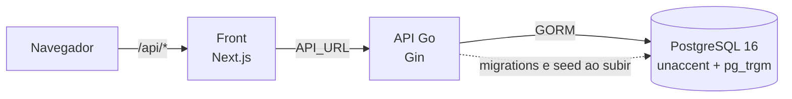

# Panda Cooking — API

[](https://github.com/Victor-Novakoski/panda-cooking-go-api/actions/workflows/ci.yml)

API REST de uma rede de receitas: cadastro e login, receitas com fotos, ingredientes e modo de preparo, busca sem acento, categorias, comentários e favoritos.

Esta é a API, em Go. O front, em Next.js, está em [panda-cooking-front](https://github.com/Victor-Novakoski/panda-cooking-front). Os dois sobem juntos com um `docker compose up` daqui; o deploy é a próxima etapa.

## Destaques

- **Sessão segura.** Access token JWT de 15 minutos e refresh token em cookie `HttpOnly`, `SameSite=Strict`, guardado no banco só como hash SHA-256. Cada renovação troca o token; token já usado, apresentado de novo, derruba a sessão inteira (sinal de cópia), com 20 segundos de tolerância para duas abas renovando juntas.
- **Proteções contra abuso.** 300 requisições por minuto por IP em toda a API, 10 por minuto no login, 10 por hora no cadastro e 30 por minuto na renovação; 5 senhas erradas bloqueiam aquele e-mail por 15 minutos, mesmo de outro IP; login com o mesmo tempo de resposta para e-mail que existe e que não existe; requisição que muda dados vinda de outra origem barrada pelo `http.CrossOriginProtection` do Go.
- **Erro de validação por campo.** Limite de tamanho em todo texto e lista (até 10 fotos, 50 ingredientes e 50 passos), campo desconhecido recusado, e 422 com a mensagem de cada campo no caminho do JSON (`ingredients[2].amount`), que o front mostra no lugar certo.
- **Busca que ignora acento:** "pao" acha "Pão de Queijo Mineiro", com `unaccent`, índice de trigramas e `%`/`_` escapados, mais filtro por categoria e por autor e paginação com total.
- **Dono de verdade.** Editar e apagar confere o autor; item de outra receita responde 404, como se não existisse, e nada é gravado. Favoritos e perfil usam sempre o usuário do token, nunca um id da URL.
- **Migrations versionadas em SQL**, embutidas no binário e aplicadas quando a API sobe.
- **Testes em três níveis:** unidade nos services (com mocks), HTTP nos handlers e integração contra um Postgres de verdade (testcontainers), incluindo as tentativas de mexer em dado de outra pessoa.
- **Contrato em OpenAPI** (`api/openapi.yaml`, servido em `/api/openapi.yaml`), com um teste que falha se uma rota servida não estiver documentada.
- **Pronta para produção.** Timeouts no servidor e prazo por requisição que chega até o banco, corpo até 1 MB, headers de segurança, log estruturado com id da requisição, desligamento gracioso e imagem distroless sem root.

Os 23 riscos e como cada um é tratado estão em [SECURITY.md](docs/SECURITY.md).

## Como funciona



O navegador fala só com o front, que repassa `/api/*` para a API pela rede interna: mesma origem, cookie de sessão sem CORS e o endereço da API fora do navegador. A API também aceita chamada direta das origens listadas em `CORS_ORIGINS`. Os detalhes estão em [ARCHITECTURE.md](docs/ARCHITECTURE.md).

## Stack

- **API:** Go 1.26, Gin, GORM, JWT (golang-jwt), bcrypt, `log/slog` e godotenv
- **Banco:** PostgreSQL 16, migrations em SQL com golang-migrate, busca com `unaccent` e `pg_trgm`
- **Testes:** `testing`, testify, mocks escritos à mão e testcontainers
- **Infra e CI:** Docker (imagem final distroless, sem root), Docker Compose e GitHub Actions (golangci-lint, testes com race e cobertura, testes de integração, build da imagem com Trivy, govulncheck, gitleaks e título do PR em Conventional Commits)

## Como rodar

Precisa só de Docker com Compose. Clone a API e o front lado a lado:

```bash
git clone https://github.com/Victor-Novakoski/panda-cooking-go-api.git
git clone https://github.com/Victor-Novakoski/panda-cooking-front.git
cd panda-cooking-go-api
cp .env.example .env
docker compose up --build
```

| O quê | Endereço |
| --- | --- |
| Site (front) | http://localhost:3000 |
| API | http://localhost:8080/health e http://localhost:8080/api/recipes |
| OpenAPI | http://localhost:8080/api/openapi.yaml |
| Postgres | `localhost:5433` (`postgres` / `postgres`) |

Na primeira subida a API aplica as migrations e cria dez receitas e três usuários. Todos entram com a senha `panda-cooking-demo`:

| Usuário | E-mail | Admin |
| --- | --- | --- |
| Chef Maria Silva | `maria@pandacooking.com` | sim |
| João Cozinheiro | `joao@pandacooking.com` | não |
| Ana Paula Gourmet | `ana@pandacooking.com` | não |

API e front recarregam sozinhos ao salvar um arquivo. Se o front estiver em outra pasta, aponte `FRONT_DIR` no `.env`; para subir só banco e API, `docker compose up api`.

> Já tinha subido uma versão antiga? Ela criava o banco sem migrations. Rode `docker compose down -v` uma vez para recriar o banco.

| Comando | O que faz |
| --- | --- |
| `make dev` | sobe banco, API e front |
| `make down` | para tudo (os dados ficam; `docker compose down -v` apaga) |
| `make seed` | apaga o banco e recria os dados de demonstração |
| `make test` | testes de unidade e de HTTP, com detector de race (precisa de Go 1.26+) |
| `make test-integration` | testes com a API e um Postgres de verdade (precisa de Docker) |
| `make lint` | golangci-lint, na mesma versão da CI |

## Um passeio pela API

Com a API no ar, usando o curl 7.82 ou mais novo (pelo `--json`) e o jq:

```bash
API=http://localhost:8080/api

# cria uma conta e entra: o access token vem no corpo, o refresh token num cookie HttpOnly
curl -s $API/users --json '{"name":"Lia Rocha","email":"lia@example.com","password":"lia-cozinha-bem"}'
TOKEN=$(curl -s -c cookies.txt $API/auth/login \
  --json '{"email":"lia@example.com","password":"lia-cozinha-bem"}' | jq -r .access_token)

# a busca ignora acento: "pao" acha "Pão de Queijo Mineiro"
curl -s "$API/recipes?search=pao&per_page=5" | jq '.items[].name'

# publica uma receita (o category_id vem de GET /api/categories)
RECEITA=$(curl -s $API/recipes -H "Authorization: Bearer $TOKEN" --json '{
  "name": "Arroz de Forno", "description": "Arroz de forno com frango, milho e queijo gratinado.",
  "time": "50 minutos", "portions": 6, "category_id": 5,
  "ingredients": [{"name": "Arroz cozido", "amount": "4 xícaras"}, {"name": "Frango desfiado", "amount": "300 g"}],
  "preparations": [{"description": "Misture tudo numa travessa."}, {"description": "Cubra com queijo e leve ao forno por 20 minutos."}]
}' | jq -r .id)

# comenta, favorita e vê as favoritas do perfil
curl -s $API/recipes/$RECEITA/comments -H "Authorization: Bearer $TOKEN" --json '{"description":"Ficou ótimo!"}'
curl -s -X POST $API/favorites/$RECEITA -H "Authorization: Bearer $TOKEN"
curl -s $API/users/profile/favorites -H "Authorization: Bearer $TOKEN" | jq '.items[].name'

# renova a sessão pelo cookie (o refresh token é trocado a cada uso) e sai
curl -s -b cookies.txt -c cookies.txt -X POST $API/auth/refresh | jq .expires_in
curl -s -b cookies.txt -X POST $API/auth/logout -o /dev/null -w '%{http_code}\n'
```

Receita incompleta não vira erro genérico: a resposta é 422 com o que falta em cada campo.

```bash
curl -s $API/recipes -H "Authorization: Bearer $TOKEN" --json '{"name":"X","ingredients":[{"name":"Sal"}]}'
```

```json
{
  "error": "dados inválidos",
  "fields": {
    "category_id": "campo obrigatório",
    "description": "campo obrigatório",
    "ingredients[0].amount": "campo obrigatório",
    "name": "use pelo menos 3 caracteres",
    "portions": "campo obrigatório",
    "preparations": "adicione pelo menos um item",
    "time": "campo obrigatório"
  }
}
```

<details>
<summary>Todas as rotas</summary>

| Método | Rota | Quem usa |
| --- | --- | --- |
| GET | `/health` | público: confere o banco |
| GET | `/api/openapi.yaml` | público: a especificação da API |
| POST | `/api/users` | público: cadastro |
| POST | `/api/auth/login` | público |
| POST | `/api/auth/refresh`, `/api/auth/logout` | cookie da sessão |
| GET, PATCH, DELETE | `/api/users/profile` | o próprio usuário |
| GET | `/api/users/profile/favorites` | o próprio usuário |
| GET | `/api/categories` | público: as 12 categorias |
| GET | `/api/recipes` | público; aceita `search`, `category_id`, `user_id`, `page` e `per_page` (até 50) |
| GET | `/api/recipes/{id}` | público: a receita com fotos, ingredientes e preparo |
| GET | `/api/recipes/{id}/comments` | público |
| POST | `/api/recipes` | logado |
| PUT, PATCH, DELETE | `/api/recipes/{id}` | o autor da receita |
| POST, PATCH, DELETE | `/api/recipes/{id}/images[/{imageID}]` | o autor da receita |
| POST, DELETE | `/api/recipes/{id}/ingredients[/{ingredientID}]` | o autor da receita |
| POST, PATCH, DELETE | `/api/recipes/{id}/preparations[/{prepID}]` | o autor da receita |
| POST | `/api/recipes/{id}/comments` | logado |
| PATCH, DELETE | `/api/comments/{id}` | o autor do comentário (apagar: também o admin) |
| GET, POST, DELETE | `/api/favorites/{recipeID}` | logado |

</details>

## Testes

```bash
make test              # unidade e HTTP, com detector de race (precisa de Go 1.26+)
make test-integration  # API e Postgres de verdade, num container (precisa de Docker)
make lint              # golangci-lint, na mesma versão da CI
```

Os de unidade usam os mocks de `internal/service/mocks`, os de HTTP sobem o roteador inteiro com os services mockados, e os de integração (`internal/integration`, com a tag `integration`) rodam contra um Postgres de verdade: cadastro, login, receita completa, comentários, favoritos e as tentativas de mexer em dado de outra pessoa.

## Estrutura

```
cmd/main.go            config → banco (migrations) → seed → servidor; desliga devagar no SIGTERM
cmd/seed/              recria os dados de demonstração (apaga o banco)
api/                   openapi.yaml, embutido no binário e servido em /api/openapi.yaml
internal/config        lê e valida as variáveis de ambiente
internal/database      conexão, pool e migrations (migrations/*.sql)
internal/seed          usuários e receitas de demonstração
internal/server        middlewares globais, tabela de rotas e ligação dos handlers
internal/model         structs do GORM (tabelas)
internal/repository    acesso ao banco; as interfaces ficam em interfaces.go
internal/service       regra de negócio, validação das entradas (inputs.go) e respostas
internal/handler       HTTP: lê a requisição, chama o service, devolve JSON; 422 por campo
internal/middleware    JWT, limite por IP, CSRF, headers de segurança, id da requisição, log e prazo
internal/ratelimit     contador de tentativas por chave (IP, e-mail), em memória
internal/integration   testes com a API e um Postgres de verdade
pkg/token              gerar e validar o JWT
```

Handler só fala HTTP; a regra de negócio (dono da receita, admin) fica no service, que depende das interfaces do repository e devolve DTOs, nunca o model direto.

## Decisões

- **GORM com migrations em SQL:** o Go fica curto, mas o schema é versionado à mão, revisável e aplicado na ordem, sem `AutoMigrate` adivinhando em produção.
- **Refresh token opaco no banco, não um JWT:** dá para revogar na hora (logout, conta apagada, token reutilizado), e o banco guarda só o hash.
- **Access token curto em vez de sessão longa:** 15 minutos limitam o estrago de um token vazado, e a renovação pelo cookie é invisível para quem usa.
- **Erro 422 com um campo por caminho do JSON:** o front mostra a mensagem no campo certo, inclusive dentro de listas, sem precisar interpretar texto.
- **Busca com `unaccent` + trigramas no Postgres** em vez de um serviço de busca: resolve "pao" achar "Pão de Queijo" com uma peça a menos para manter.
- **Item de outra receita responde 404, não 403:** não confirma nem a existência do id para quem não é o dono.

O registro completo está em [MEMORY.md](docs/MEMORY.md).

## Documentação

| Documento | Conteúdo |
| --- | --- |
| [PRD](docs/PRD.md) | O que o produto faz |
| [Arquitetura](docs/ARCHITECTURE.md) | Camadas, middlewares, modelo de dados e rotas |
| [Design](docs/DESIGN.md) | Convenções da API: erros, paginação e autenticação |
| [Segurança](docs/SECURITY.md) | Cada risco e como foi tratado |
| [Regras](docs/RULES.md) | Código, segurança, testes e fluxo de git |
| [Tarefas](docs/TASKS.md) e [Memória](docs/MEMORY.md) | O que foi feito e o porquê de cada decisão |
| [Seed](cmd/seed/README.md) | Os dados de demonstração |
| [OpenAPI](api/openapi.yaml) | Rotas, corpos e respostas |

## Próximos passos

O deploy: API e front em containers atrás de HTTPS, banco sem porta publicada, `TRUSTED_PROXIES` e `CORS_ORIGINS` ajustados e segredos fora de arquivo. O que falta está em [TASKS.md](docs/TASKS.md).

Feito por [Victor Novakoski](https://github.com/Victor-Novakoski).
